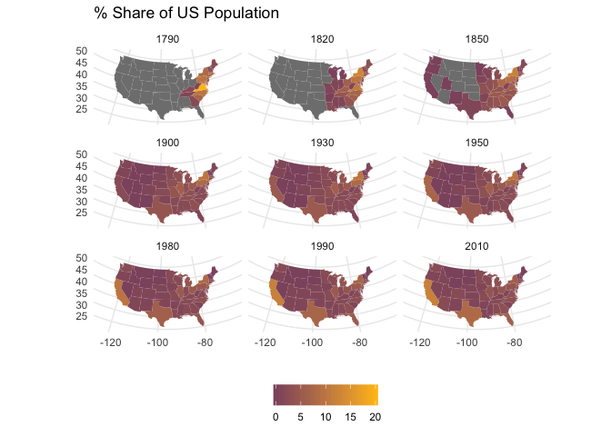
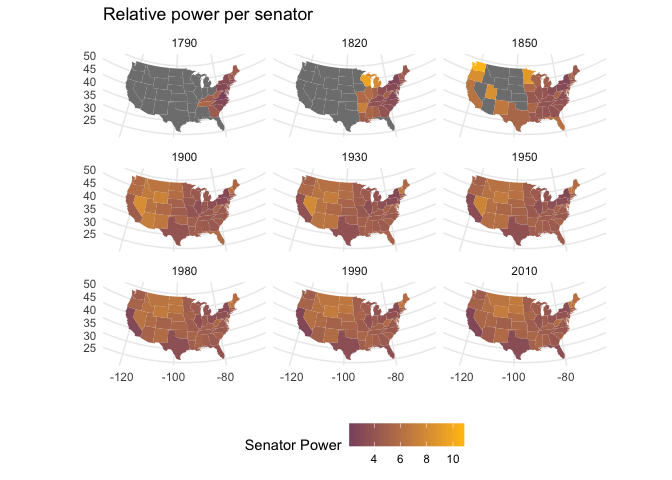

US Representation Power
================

In light of the recent midterms my head has been in a complete tizzy about the increasing domination of the senate by a smaller and smaller population of the US. This repository serves as a basis for an examination of the Connecticut Compromise and its changing role in US Republican democracy.

I created this repository for those who may also be interested in these data.

### Population Data

``` r
census_tables <- read_csv("data/census_state_pop.csv")
enslaved <- read_csv("data/us_enslaved_pop.csv")

# Join the tables and create a secondary population column
# pop represents apportioned population based on 3/5th rule :( 
census <- left_join(census_tables, select(enslaved, -population),
                    by = c("name", "year")) %>% 
  mutate(pop = population + replace_na(census_slave_pop, 0))
```

### Relative Senator Power

To evaluate the change in the relative representative power of a state senator I created a new metric that I call `senator_power`. This metric is created by scaling the number of senators (2) by a state's share of the national population and taking the natural logarithm of that number.


``` r
# create metrics for share of population and a relative power of 
# senator (scaling number of senators by share of population)
senator_power <- census %>% 
  filter(!is.na(population)) %>% 
  # remove the US as it will throw off calculations
  filter(name != "United States") %>% 
  group_by(year) %>% 
  # find the total population for a given year
  mutate(total_pop = sum(pop, na.rm = TRUE)) %>% 
  ungroup() %>% 
  mutate(share_pop = pop / total_pop,
        # created metric for senator_power
         senator_power = log(2/ share_pop))

head(senator_power)
```

    ## # A tibble: 6 x 8
    ##   name   year population census_slave_pop    pop total_pop share_pop
    ##   <chr> <int>      <int>            <dbl>  <dbl>     <dbl>     <dbl>
    ## 1 Conn…  1790     237946            1658. 2.40e5  4348023.    0.0551
    ## 2 Dela…  1790      59096            5332. 6.44e4  4348023.    0.0148
    ## 3 Geor…  1790      82548           17558. 1.00e5  4348023.    0.0230
    ## 4 Kent…  1790      73677            7458  8.11e4  4348023.    0.0187
    ## 5 Maine  1790      96540               0  9.65e4  4348023.    0.0222
    ## 6 Mary…  1790     319728           61822. 3.82e5  4348023.    0.0878
    ## # ... with 1 more variable: senator_power <dbl>

### Relative Representative Power

Measuring the relative power of a congressperson is much more straight forward. Congresspeople are more or less apportioned by a state's share of population. I created a metric *relative representative power* (`relative_rep_power`) as the number of representatives a state has divided by the total number of representatives in congress.


``` r
reps <- read_csv("data/us_house.csv")

reps %>% 
  arrange(-relative_rep_power) %>% 
  head()
```

    ## # A tibble: 6 x 6
    ##   state  year n_reps state_name total_reps relative_rep_power
    ##   <chr> <int>  <int> <chr>           <int>              <dbl>
    ## 1 NY     1830     40 New York          240              0.167
    ## 2 NY     1820     34 New York          213              0.160
    ## 3 VA     1800     22 Virginia          142              0.155
    ## 4 NY     1840     34 New York          223              0.152
    ## 5 NY     1810     27 New York          182              0.148
    ## 6 NY     1850     33 New York          234              0.141

------------------------------------------------------------------------

Combining Data Sets
-------------------

To prep these data for visualization, they need to be joined together. The below code joins the representative data to the population and senate data, then to spatial data that comes from `ggplot2`.

``` r
# join reps & senate data
pop_house <- full_join(reps, senator_power,
          by = c("state_name" = "name", "year")) %>% 
  rename(name = state_name)


# Get map level spatial data to join and plot
states <- map_data("state") %>% 
  mutate(region = str_to_title(region)) %>% 
  rename(name = region)

# join data to spatial data
states_df <- inner_join(pop_house, states, by = "name") %>% 
  as_tibble()
```

------------------------------------------------------------------------

### Visualization

#### Share of population over time

``` r
# make plot of % share of pop
states_df %>% 
  mutate(senator_power = replace_na(senator_power, 0)) %>% 
  filter(!is.na(senator_power), !is.na(year),
         # select a few years for presentation
         year %in% c(1790, 1820, 1850, 1900, 1930,
                     1950, 1980, 1990, 2010)) %>% 
  ggplot(aes(long, lat, group = group, 
             # make it a percent
             fill = round(share_pop*100))) + 
  geom_polygon(size = 0) + 
  # none of this flat top ugly continental US stuff
  coord_map(projection = "albers", lat0 = 39, lat1 = 45) +
  labs(x = "", y = "", title = "% Share of US Population") + 
  scale_fill_gradient(low = "#8E556D", high = "#ffbf11",
                      guide = guide_colorbar("")) +
  facet_wrap(~year) + 
  theme(legend.position = "bottom",
        plot.title = element_text(hjust = 0))
```



#### Relative Senator Power over time

``` r
states_df %>% 
  filter(year %in% c(1790, 1820, 1850, 1900, 1930, 
                     1950, 1980, 1990, 2010)) %>% 
  ggplot(aes(long, lat, group = group, 
             fill = (senator_power))) + 
  geom_polygon(size = 0) + 
  coord_map(projection = "albers", lat0 = 39, lat1 = 45) +
  labs(x = "", y = "", title = "Relative power per senator") + 
  scale_fill_gradient(low = "#8E556D", high = "#ffbf11",
                      guide = guide_colorbar("Senator Power")) +
  facet_wrap(~year) + 
  theme(legend.position = "bottom",
        plot.title = element_text(hjust = 0))
```


